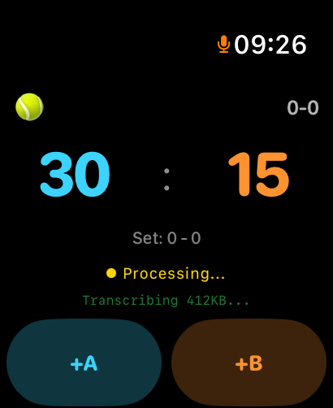

# TennisWatch

[](https://github.com/mustafaergen-art/TennisWatch/actions/workflows/build.yml)
[](LICENSE)
[](#requirements)
[](https://swift.org)
[](https://docs.x.ai/developers/model-capabilities/audio/voice-agent)

Hands-free tennis score tracking on Apple Watch — call out the score in Turkish or English while you play, and the watch updates the scoreboard.

## Demo

<p align="center">
  
</p>

The voice path runs through xAI's realtime audio model (`grok-voice-think-fast-1.0`) over a WebSocket. Speech goes in, normalized score text comes out (e.g. `"15-0"`, `"GAME"`, `"kort değiştir"`), and a local state machine applies it to the match. The companion iOS app stores match history and shows live scores from outside tournaments.

## Features

- **Voice-driven scoring** — supports Turkish/English score calls, `deuce`, `advantage`, `tiebreak`, `out`, `setler X-Y`, `oyun` / `game`, etc.
- **Apple Watch first** — score, set summary, court-side change indicator, heart rate, calories, location.
- **Match history** — duration, points, outs, GPS court detection, transcripts.
- **iOS companion** — past matches, live ATP/WTA/ITF scores via Sofascore-style feed.
- **Continuous listening** — server VAD on xAI side handles speech segmentation; no manual button.

## Requirements

- macOS with Xcode 15+
- Apple Watch Series 5+ (or simulator) on watchOS 10+
- iPhone on iOS 17+ (paired with the watch)
- An xAI API key — sign up at [console.x.ai](https://console.x.ai)

## Setup

### 1. Clone

```bash
git clone https://github.com/<your-handle>/TennisWatch.git
cd TennisWatch
open TennisWatch.xcodeproj
```

### 2. Add your xAI API key

The app resolves the key from two sources at runtime, in order. Pick the one you prefer.

> ⚠️ **Do NOT put the key in a *shared* Xcode scheme.** Shared scheme XML lives under `TennisWatch.xcodeproj/xcshareddata/xcschemes/` and is committed to git. CI and other contributors need shared schemes, so we keep the secret out of them entirely.

**Option A — global launchd env var (simplest, no files):**

```bash
launchctl setenv XAI_API_KEY xai-your-key-here
```

Then **quit Xcode completely and reopen it** so it inherits the variable. The key persists until reboot. To make it permanent across reboots, write a launchd plist; for casual development, re-running this command after each reboot is fine.

To clear:

```bash
launchctl unsetenv XAI_API_KEY
```

**Option B — local `Secrets.plist` (gitignored):**

1. In Xcode: **File → New → File from Template…** → **Property List** → name it `Secrets.plist`.
2. Save it inside `TennisWatch/` and **check both targets** (`TennisWatch` + `TennisApp`'s embedded watch app) when prompted.
3. Open `Secrets.plist`, add a row with **Key** = `XAI_API_KEY` (String), **Value** = your `xai-...` key.
4. The repo's `.gitignore` already excludes `Secrets.plist`, so it stays local.

For both options: ship-time builds (TestFlight / App Store) need a different strategy — see [xAI's docs](https://docs.x.ai/developers/model-capabilities/audio/voice-agent) on ephemeral tokens.

### 3. Build and run

- **Watch (standalone)**: select the **TennisWatch** scheme + an Apple Watch destination, ⌘R.
- **iOS + watch**: select the **TennisApp** scheme + an iPhone destination, ⌘R.

On first launch the watch will request microphone and speech recognition permission. Grant both. Say `"15 sıfır"` or `"thirty love"` — you should see the score update within a second.

## Architecture

```
[Apple Watch mic]
   │  AVAudioEngine tap (16/48 kHz mono float32)
   ▼
[AudioListenerManager]              <- TennisWatch/AudioListenerManager.swift
   │  AVAudioConverter → 24 kHz Int16 PCM
   │  base64 chunks
   ▼
[xAI Realtime WebSocket]            wss://api.x.ai/v1/realtime
   │  server_vad → response.text.delta
   ▼
[ScoreManager.processDictatedText]  <- TennisWatch/ScoreManager.swift
   │  local command parsing + quickParseTurkish()
   ▼
[SwiftUI ContentView]
```

Key files:

- `TennisWatch/AudioListenerManager.swift` — xAI WebSocket client, audio capture, format conversion.
- `TennisWatch/ScoreManager.swift` — match state machine, undo, tiebreak, set/court tracking.
- `TennisWatch/HeartRateManager.swift` — HealthKit + CoreLocation, court detection.
- `TennisWatch/ContentView.swift` — watch UI.
- `TennisApp/` — iOS app: history, live scores, share cards.

## How the voice agent is prompted

The xAI session is configured with instructions (in [`AudioListenerManager.swift`](TennisWatch/AudioListenerManager.swift)) that tell the model to output **one** normalized line per utterance:

| User says | Model emits |
|-----------|-------------|
| "fifteen love" / "on beş sıfır" | `15-0` |
| "deuce" / "kırk kırk" | `40-40` |
| "advantage" / "avantaj" | `AD-40` |
| "oyun" / "game" / "fifty" | `GAME` |
| "kort değiştir" | `kort değiştir` |
| "maç bitti" | `maç bitti` |
| "setler 2-0" | `setler 2-0` |
| anything else | literal transcription |

`ScoreManager.processDictatedText` then maps that line to a state transition. Common Whisper-style mishearings (`kök` → `kırk`, `om beş` → `on beş`) are corrected by the model before the watch ever sees the text.

## Privacy

- **Microphone audio** is streamed to xAI for transcription/normalization. No audio is stored on-device or by the app developer; xAI's retention policy applies. See [xAI's privacy docs](https://x.ai/legal/privacy-policy).
- **Match history** is stored locally on the watch and synced to iCloud via CloudKit (entitlement in `TennisWatch.entitlements`).
- **Location** is used only to detect court boundaries / side mismatches; coordinates stay on-device.
- **Heart rate** is read via HealthKit, never transmitted.

## Contributing

Issues and PRs welcome. Areas where help is especially useful:

- Additional language support (the prompt currently targets Turkish + English)
- Replacing scheme env vars with a proper ephemeral-token backend for App Store builds
- Better tiebreak voice commands
- Doubles support

## License

[MIT](LICENSE).

This project is not affiliated with xAI or Anthropic.
